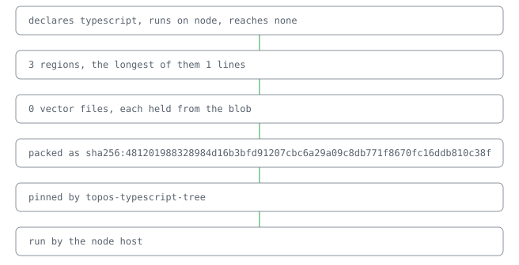

# @lapxo/topos-typescript-tree

     

A TypeScript module read by the language: its head, its signatures, its imports, its literals, and what it writes that a place customises.

## Why the language

What a module says is what the language reads. A pattern over its text is not a reading.

## One module, read by the language

## Line

Add to your lock:
sources/topos-typescript-tree value=github:Lapxo/topos-typescript-tree
uses/topos-typescript-tree sha256:<release digest>
https://github.com/Lapxo/topos-typescript-tree/releases
Fetch the release asset, verify its sha256 equals the uses/ line, place it in bound/cas/blobs/. Fold: its pages appear.
open: line/install needs=host/resolve — when bound resolves sources/ itself, the fetch line leaves the page by fold.

It rests on topos.

## Check

● 0 cases hold

● `npm ci && npm run build`

## Pointers

- [Reference](docs/reference.md)
